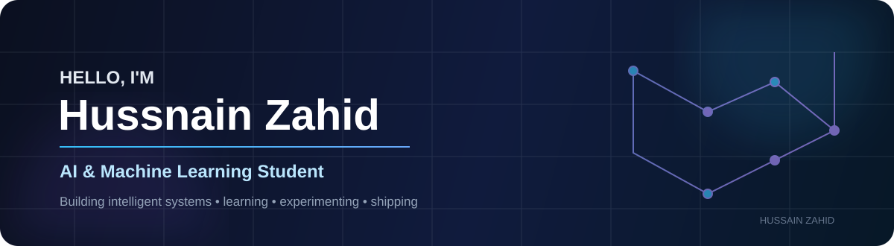

  
  
  
  

### AI & Machine Learning Student · Building Intelligent Systems · Learning in Public

---

## 👋 About Me

Hi, I'm **Hussnain Zahid**, an **AI & Machine Learning student** passionate about artificial intelligence, technology, and building solutions to real-world problems.

I enjoy turning data and ideas into **practical intelligent systems** that can automate tasks, improve decisions, and create meaningful impact. I'm currently strengthening my skills across **Python, Machine Learning, Deep Learning, Computer Vision, Retrieval-Augmented Generation (RAG), and Agentic AI**.

I learn best by building—experimenting with new tools, solving challenging problems, and turning concepts into working solutions. I'm especially interested in AI systems that are **context-aware, useful, reliable, and capable of handling complex tasks**.

🎯 **Career goal:** Grow into an **AI/ML Engineer** and contribute to innovative products and intelligent systems that solve meaningful problems.

🤝 **Open to:** Learning, collaboration, AI/ML projects, technical conversations, and opportunities to build with other developers.

---

## 🧠 Current Focus

<table>
<tr>
<td width="50%" valign="top">

### 🤖 AI / ML
- Machine Learning fundamentals
- Deep Learning
- Computer Vision
- Model experimentation & evaluation

</td>
<td width="50%" valign="top">

### 🧩 Modern AI
- Retrieval-Augmented Generation (RAG)
- Agentic AI
- Context-aware applications
- Practical AI automation

</td>
</tr>
</table>

---

## 🛠️ Technology Stack

### 🤖 AI, Machine Learning & Data

  

**NumPy · Pandas · Scikit-learn · Matplotlib · Seaborn · RAG · Agentic AI**

### 📓 AI & Data Platforms

  

**Google Colab · Jupyter Notebook · Anaconda**

### 🌐 Web Development

  

### ⚙️ Backend & Databases

  

### ☁️ DevOps, Cloud & Developer Tools

  

---

## 🚀 What I Like Building

> **AI that is useful, not just impressive.**

My interests are centered around projects that connect **data + intelligent models + practical software**.

| Area | What I'm exploring |
| --- | --- |
| 🧠 Machine Learning | Predictive models, experimentation, evaluation |
| 👁️ Computer Vision | Image understanding and intelligent visual systems |
| 📚 RAG | Knowledge-grounded AI applications |
| 🤝 Agentic AI | AI systems that can reason through multi-step tasks |
| 📊 Data Science | Data analysis, visualization, and extracting useful insights |
| ⚙️ AI Engineering | Turning models into usable applications and workflows |

---

## 📈 GitHub Analytics

  

---

## 🐍 Contribution Graph

<picture>
  <source media="(prefers-color-scheme: dark)" srcset="https://raw.githubusercontent.com/HussnainZahid/HussnainZahid/output/github-contribution-grid-snake-dark.svg">
  <source media="(prefers-color-scheme: light)" srcset="https://raw.githubusercontent.com/HussnainZahid/HussnainZahid/output/github-contribution-grid-snake.svg">
  
</picture>

---

## 🌐 Let's Connect

If you're interested in **AI, Machine Learning, intelligent applications, or building useful technology**, feel free to connect.

 

  

**Build • Learn • Experiment • Improve**

---

📌 Profile Notes

 

This profile is intentionally focused on my **AI/ML learning journey and practical engineering interests**. As I build more substantial projects, this section will evolve to highlight selected work, technical write-ups, and measurable outcomes.

